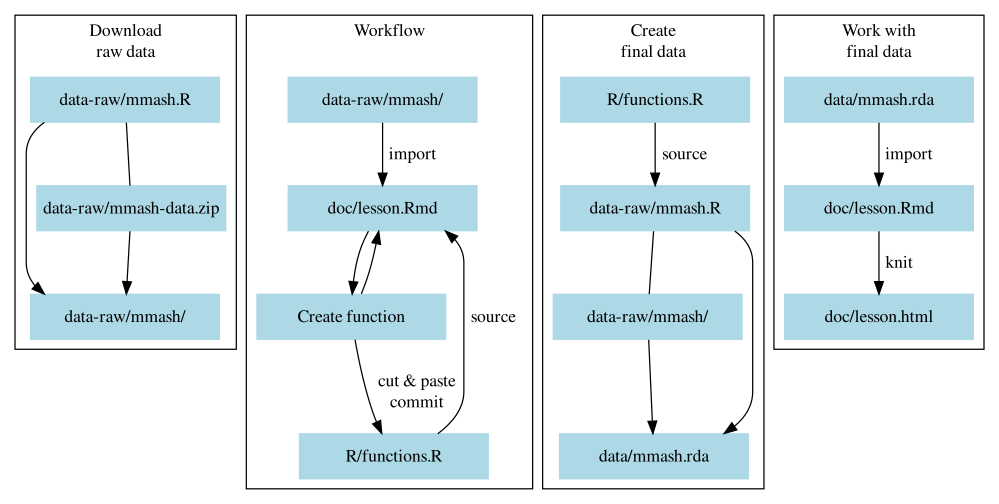

# Basic setup and workflow {#intro}

## Introduction to course

**[Introduction slides](slides/introduction.html)**

```{r slides-page-frame, echo=FALSE}
knitr::include_url("slides/introduction.html", height = "375px")
```

`r details_for_instructors("The slides contain speaking notes that you can view by pressing 'p' on the keyboard.")`

## Overview of workflow

**Take 5 min to read over this section before we go over it together**.

This section provides an bigger picture view of what we will be doing,
how we will be going about doing it, and what it will look like in the end.
Both the folder and file structures below as well as the 
Figure \@ref(fig:diagram-overview) show exactly what we will be doing and how
it will look like at the file level (not at the R code level).
Hopefully with this overview, you can better understand where we are and where
we want to get to. A comment on naming: whenever folder names are given,
they always end in `/`, for instance `data/` or `doc/`.

Right now, everyone's initial project structure should look like:

```
LearnR3
├── data/
│   └── README.md
├── data-raw/
│   ├── mmash-data.zip
│   ├── mmash/
│   │  ├── user_1
│   │  ├── ...
│   │  └── user_22
│   └── mmash.R
├── doc/
│   ├── README.md
│   └── lesson.Rmd
├── R/
│   ├── functions.R
│   └── README.md
├── .gitignore
├── DESCRIPTION
├── LearnR3.Rproj
├── README.md
└── TODO.md
```

At the end of this workshop, it should look something like:

```
LearnR3
├── data/
│   ├── README.md
│   └── mmash.rda
├── data-raw/
│   ├── mmash-data.zip
│   ├── mmash/
│   │  ├── user_1
│   │  ├── ...
│   │  └── user_22
│   └── mmash.R
├── doc/
│   ├── README.md
│   ├── lesson.html
│   └── lesson.Rmd
├── R/
│   ├── README.md
│   └── functions.R
├── .gitignore
├── DESCRIPTION
├── LearnR3.Rproj
└── README.md
```

Our workflow will generally look like Figure \@ref(fig:diagram-overview-0),
with each block representing one or two sessions. We've already done a bit
of the first block, *"Download raw data"*.

```{r diagram-overview-0, fig.cap="Overview of the workflow we will be using and covering.", echo=FALSE}

```

Our workflow and process will be something like:

- Make an R script (`data-raw/mmash.R`) to download the dataset (`data-raw/mmash/`),
which you already did in the pre-course tasks.
- Use R Markdown (`doc/lesson.Rmd`) to write and test out code, convert it into
a function, test it, and then move it into `R/functions.R`.
- Use a combination of restarting R (`Ctrl-Shift-F10` or "Session -> Restart
R") and using `source()` (`Ctrl-Shift-S` while in `R/functions.R`) to run the
functions inside of `R/functions.R`.
- Replace the old code in the R Markdown document (`doc/lesson.Rmd`) with the
new function.
- Finish building functions that prepare the dataset, use them in the cleaning
script (`data-raw/mmash.R`), run the script and save the data as an `.rda`
file (`data/mmash.rda`).
- Remove the old code from the R Markdown document (`doc/lessons.Rmd`).
- Whenever we complete a task, we add and commit those file changes and save
them into the Git history.

## Setting up our project

**We'll do this all together**.
Now that we've gone over the overview, let's get our project ready for the next
steps. But first, we need to do a few things. Since we did all that work in the
pre-course tasks downloading the data and unzipping it, we need to save these
changes to the Git history. Open the Git interface with either the Git icon at
the top near the menu bar, or with `Ctrl-Alt-M`. When the Git inferface opens up
we'll click the checkbox beside the `.gitignore` and `data-raw/mmash.R` files.
Then we write a commit message in the text box on the right, something like
"Code to download data zip file". Click the "Commit" button and close the Git
interface.

Next, delete one of the files we don't need by using the [fs] package.

[fs]: https://fs.r-lib.org/

In the **Console**, type out:

```{r remove-extra-files, eval=FALSE}
fs::file_delete("TODO.md")
```

Then, open up the `README.md` and fix some of the TODO items.
After cleaning everything up, now we need to use Git to add and commit all the 
current files into the history. Open up the Git interface in RStudio with
`Ctrl-Alt-M` or through the Git button. Write a message in the commit textbox
saying "Added initial files". Now we're ready for the next session!
