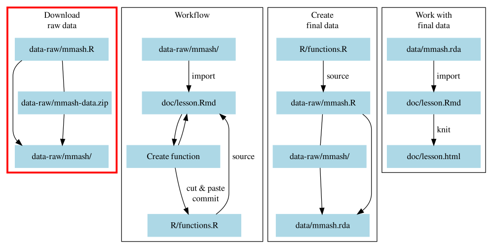

# Importing data, fast! {#import-data}

During this session we'll be covering the first block, "*Download raw data*" in
Figure \@ref(fig:diagram-overview-1). You already downloaded and unzipped the 
raw data during the [pre-course](pre-course.html) tasks and here we'll continue
the process by now importing it into R.

```{r diagram-overview-1, fig.cap="Section of the overall workflow we will be covering.", echo=FALSE}

```
Right now, your folder and file structure should look like:

```
LearnR3
├── data/
│   └── README.md
├── data-raw/
│   ├── mmash-data.zip
│   ├── mmash/
│   │  ├── user_1
│   │  ├── ...
│   │  └── user_22
│   └── mmash.R
├── doc/
│   ├── README.md
│   └── lesson.Rmd
├── R/
│   ├── functions.R
│   └── README.md
├── .gitignore
├── DESCRIPTION
├── LearnR3.Rproj
└── README.md
```

## Learning objectives

1. Learn how to import data and do minor cleaning with the
[vroom][vroom-website] package.
1. Learn about strategies and resources to use when encountering problems when
importing data (arguably one of the most important skills in any coding-type
work).
1. Practice using Git version control as part of the data analysis workflow.

## Importing in the raw data

The ultimate goal for the beginning phases of a data analysis project is to
eventually save a version of the raw data that you can work on.
The first step to processing data is to import it into R so we can work on it.
So for now, we'll open up the `doc/lesson.Rmd` file so we can start building
and testing out the code.
At the bottom of the file, create a new header by typing out `## Importing raw data`.
Right below the header, make a new code chunk with `Ctrl-Alt-I` and call it
`setup`. Inside the code chunk, load the [vroom][vroom-website] package
with `library(vroom)` as well as `library(here)`. It should look like this:

[vroom-website]: https://vroom.r-lib.org/index.html

````markdown
`r ''````{r setup}
library(vroom)
library(here)
`r ''````
````

This is a special, named code chunk that tells R to run this code chunk first
whenever you open this R Markdown file and run code inside of the file.
It's in this `setup` code chunk that we will add `library()` functions when we
want to load other packages.

**Take 5 minutes to read the next paragraphs until it says to stop**.

What is [vroom][vroom-website]? It is a package designed to load in data, specifically
text-based data files such as CSV. In R there are several packages that you can
use to load in data and of different types of file formats. We won't cover
these other packages, but you can use this as a reference for when or if you
ever have to load other file types:

- [haven][haven]: For reading (also known as importing or loading) in SAS, SPSS, and
Stata files.
- [readxl][readxl]: For reading in Excel spreadsheets with `.xls` or `.xlsx` file
endings.
- [googlesheets4][googlesheets4]: For reading in Google Sheets from their cloud service.
- [readr][readr]: Standard package used to load in text-based data files like CSV. 
This package is included by default within the tidyverse.
- [`utils::read.delim()`][read-delim]: This function comes from the core R
package utils and includes other functions like `utils::read.csv()`.
- [`data.table::fread()`][fread]: From the [data.table] package, this function is 
used to load in CSV files.

[data.table]: https://rdatatable.gitlab.io/data.table/
[haven]: https://haven.tidyverse.org/
[readxl]: https://readxl.tidyverse.org/
[googlesheets4]: https://googlesheets4.tidyverse.org/
[readr]: https://readr.tidyverse.org/
[read-delim]: https://www.rdocumentation.org/packages/utils/versions/3.6.2/topics/read.table
[fread]: https://rdatatable.gitlab.io/data.table/reference/fread.html

We're using the vroom package for largely one reason: It makes use of recent
improvements in R that allow data to be imported into R very very quickly. 
Just how fast? The vroom website has a [benchmark page](https://vroom.r-lib.org/articles/benchmarks.html)
showing how fast it is. For many people, loading in the data can be one of
the most time-consuming
parts of starting an analysis. Hopefully by using this package, that time can be
reduced. 

The packages readr, vroom, haven, readxl, and googlesheets4 all are very
similar in how you use them and their documentation are almost identical. So
the skills you learn in this session with vroom can mostly be applied to 
these other packages.
And because readr (which the other packages are based on) has been around for
awhile, there is a large amount of support and help for using it.
If you're curious to learn more about vroom, check out the 
[website][vroom-website].

If your data is in CSV format, vroom is perfect. The CSV file format is a
commonly used format for data because it is open and transparent, readable by
any computer, and doesn't depend on any special software to open (unlike for
e.g. Excel spreadsheets). 
**Please stop reading and we'll go over this together**.

Let's first start by creating an object that has the file path to the dataset,
then we'll use `vroom()` to import that dataset.

```{r setup-02, include=FALSE}
library(vroom)
library(here)
```

```{r first-load-in-user-info}
user_1_info_file <- here("data-raw/mmash/user_1/user_info.csv")
user_1_info_data <- vroom(user_1_info_file)
```

You'll see the output mention using `spec()` to use in the argument `col_types`.
And that it has 5 columns, one called `...1`. If we look at the CSV file though,
we see that there are only four columns with names... but that technically 
there is a first empty column without a column header.
So, let's figure out what this message means. 
Let's go to the **Console** and type out:

```r
?vroom::spec
```

In the documentation, we see that it says:

> "extracts the full column specification from a tibble..."

Without seeing the output, it's not clear what "specification" means. Use
`spec()` on the dataset object. In the **Console** again:

```{r}
spec(user_1_info_data)
```

This shows that a specification is a list and description of which columns are imported
into R and what data types they are given. For instance, `col_double()` means 
numeric (double is how computers represent non-integer numbers) and
`col_character()` means a character data type. Next, let's see what the message
meant about `col_types`. Let's check out the help documentation for `vroom()` by
typing in the **Console**:

```r
?vroom::vroom
```

And if we scroll down to the explanation of `col_types`:

> "One of NULL, a cols() specification, or a string. See vignette("readr") for
more details."

It says to use a "cols() specification", which is the output of `spec()`.
Copy the output from `spec()` and paste it into the `col_types` argument of `vroom()`.

```{r vroom-with-error, error=TRUE, warning=TRUE}
user_1_info_data <- vroom(
    user_1_info_file,
    col_types = cols(
        ...1 = col_double(),
        Gender = col_character(),
        Weight = col_double(),
        Height = col_double(),
        Age = col_double(),
        .delim = ","
    )
)
```

Hmm. A warning and an error message. Let's deal with the error message first.
We copied and pasted, so what's going on? If you recall, the `user_info.csv`
file has an empty column name. Looking at the [data dictionary][mmash-site]
it doesn't seem there is any reference to this column, so it likely isn't 
important. More than likely, vroom is complaining about this empty column 
name and the use of `...1` to represent it. We don't need it, so we'll 
get rid of it when we load in the dataset. But how? Look at the help
documentation again. Go to the **Console** and type out:

[mmash-site]: https://physionet.org/content/mmash/1.0.0/

```r
?vroom::vroom
```

Looking at the list of arguments, there is an argument called `col_select`
that sounds like we could use that to keep or drop columns. It says that it
is used similar to `dplyr::select()`, which normally is used with actual column 
names. Our column doesn't have a name, that's the problem. Next check the
Example section of the help. Scrolling down, you'll eventually see:

> `vroom(input_file, col_select = c(1, 3, 11))`

So, it takes numbers! With `dplyr::select()`, using the `-` before the column
name (or number) means to drop the column, so in this case, we could drop the
first column with `col_select = -1`!

```{r second-load-in-info-no-error}
user_1_info_data <- vroom(
    user_1_info_file,
    col_select = -1,
    col_types = cols(
        Gender = col_character(),
        Weight = col_double(),
        Height = col_double(),
        Age = col_double()
    )
)
```

Amazing! We did it `r emo::ji("grin")`

But... we still have the warning message. You may or may not see this message
depending on the version of your packages (the most updated packages
will show this), but you can see it in the code chunk above.

This is `vroom()` letting you know that a column was renamed because
you didn't explicitly indicate that you wanted it renamed.
This is the empty column. Even though we excluded it with `col_select = -1`,
that only excludes it after importing it.

To remove this new message, we need to tell `vroom()` exactly how to handle
renaming cases. Let's look at the help docs of vroom: `?vroom`. Scroll down and
we see an argument called `.name_repair` that handles naming of columns. Going
into the provided link takes us to the `tibble::tibble()` help documentation.
Scroll down to the `.name_repair` argument documentation and it says that it
treats problematic column names, of which a missing column name is definitely a
problem. There are several options here, but the one I want to focus on is the
comment about "function: apply custom name repair". This is an important one
because we eventually want to rename the columns to match the [style guide] by
using `snake_case`, since there is a package to do that called
[snakecase][snakecase-pkg].

[snakecase-pkg]: https://tazinho.github.io/snakecase/

In the Console, type out `snakecase::` and hit Tab. You'll see a list of
possible functions to use. We want to use the snake case one, so scroll down and
find the `to_snake_case()`. That's the one we want to use.
So to remove the messages and convert the variable names to snake case, we
would add `.name_repair = snakecase::to_snake_case` to the code.
Notice the lack of `()` when using the function. We'll explain more about this
in later sessions.

```{r use-name-repair}
user_1_info_data <- vroom(
    user_1_info_file,
    col_select = -1,
    col_types = cols(
        Gender = col_character(),
        Weight = col_double(),
        Height = col_double(),
        Age = col_double()
    ),
    .name_repair = snakecase::to_snake_case
)
```

Ok, no more messages! We can now look at the data:

```{r print-user-info-data}
user_1_info_data
```

Why might we use `spec()` and `col_types`? Depending on the size of the dataset,
it could take a long time to load everything, which may not be very efficient
if you only intend to use some parts of the dataset and not all of it.
And sometimes, `spec()` incorrectly guesses the column types, so using
`col_types = cols()` can fix those problems.

If you have a lot of columns in your dataset, then you can make use of
`col_select` or `cols_only()` to keep only the columns you want.
Before moving on to the exercise, add and commit the changes to the Git history
through the RStudio Git interface with `Ctrl-Alt-M`, through the Git tab, or
the Git button.

## Exercise: Import the saliva data {#ex-import-saliva}

Time: 15 min

Practice importing data files by doing the same process with the saliva data.

1. Create a new header at the bottom of the `doc/lesson.Rmd` file
and call it `## Exercise: Import the saliva data`.
1. Below the header, create a new code chunk with `Ctrl-Alt-I`.
1. Copy and paste the code template below into the new code chunk.
Begin replacing the `___` with the correct R functions or other information.
1. Once you have the code working, use the RStudio Git interface to add and 
commit the changes into the version history.

```{r exercise-template-saliva-import, eval=FALSE}
user_1_saliva_file <- here("data-raw/mmash/user_1/___")
user_1_saliva_data_prep <- vroom(user_1_saliva_file,
                                 col_select = ___)
___(user_1_saliva_data_prep)

user_1_saliva_data <- vroom(
    user_1_saliva_file,
    col_select = ___,
    col_types = ___,
    .name_repair = ___
)
```

```{r solution-import-the-saliva-data, results='hide', solution=TRUE}
user_1_saliva_file <- here("data-raw/mmash/user_1/saliva.csv")
user_1_saliva_data_prep <- vroom(user_1_saliva_file,
                                 col_select = -1)
spec(user_1_saliva_data_prep)

user_1_saliva_data <- vroom(
    user_1_saliva_file,
    col_select = -1,
    col_types = cols(
        SAMPLES = col_character(),
        `Cortisol NORM` = col_double(),
        `Melatonin NORM` = col_double()
    ),
    .name_repair = snakecase::to_snake_case
)
```

## Importing larger datasets

Sometimes you may have a dataset that's just a bit too large. Sometimes vroom
may not have enough information to guess the data type of the column.
Or maybe there are hundreds or thousands of columns in your data
and you only want to import specific columns.
In these cases, we can do a trick: read in the first few lines of the dataset,
use `spec()` and paste in the output into the `col_type` argument,
and then keep only the columns you want to keep.

Let's do this on the `RR.csv` file. 
We can see from the file size that it is bigger than most of the other files 
(~2Mb). So, we'll use this technique to decide what we want to keep. 
First, create a new header `## Import larger datasets` and a new code chunk below it
(with `Ctrl-Alt-I`). 

Do the same thing that we've been doing, but this time we are going to use the
argument `n_max`, which tells vroom how many rows to read into R. In this case,
let's read in 100, since that is the amount vroom will guess until. This dataset,
like the others, has an empty column that we will drop.

```{r import-some-of-data-trick}
user_1_rr_file <- here("data-raw/mmash/user_1/RR.csv")
user_1_rr_data_prep <- vroom(user_1_rr_file,
                             n_max = 100,
                             col_select = -1)
spec(user_1_rr_data_prep)
```

Like with last time, copy and paste the output into a new use of `vroom()`.
Remove the `.delim` line and the `...1` line. Add the `.name_repair` argument
with `snakecase::to_snake_case`. Don't forget to also remove the
last `,` at the end! Make sure to remove the `n_max` argument, since we want to
import in the whole dataset.

```{r}
user_1_rr_data <- vroom(
    user_1_rr_file,
    col_select = -1,
    col_types = cols(
        ibi_s = col_double(),
        day = col_double(),
        # Converts to seconds
        time = col_time(format = "")
    ),
    .name_repair = snakecase::to_snake_case
) 
```

There's a new column type: `col_time()`. To see all the other types of column 
specifications, in the Console type out `col_` and then hit the Tab key. 
You'll see other types, like `col_date`, `col_factor`, and so on.
Right, back to the data, what does it look like?

```{r}
user_1_rr_data
```

To make sure everything is so far reproducible within the `lesson.Rmd` file,
we will "Knit" the R Markdown document to output an HTML file. Click the "Knit"
button at the top of the Source pane or by typing `Ctrl-Shift-K`. If it generates
an HTML document without problems, we know our code is at least starting to be
reproducible.

## Exercise: Import the Actigraph data

Time: 15 min

Practice some more. Do the same thing with the `Actigraph.csv` dataset as
we did for the `RR.csv`. But first:

1. Create a new header at the bottom of the `doc/lesson.Rmd` file
and call it `## Exercise: Import the Actigraph data`.
1. Below the header, create a new code chunk with `Ctrl-Alt-I`.

Use the *same technique* as we used for the `RR.csv` data 
and read in the `Actigraph.csv` file from `user_1/`.

1. Set the file path to the dataset with `here()`. 
1. Read in a max of 100 rows for `n_max` and exclude the first column with
`col_select = -1`.
1. Use `spec()` to output the column specification and paste the results into
`col_types()`. Don't forget to remove the `...1 = col_skip()` and the 
`.delim = ","` line from the `cols()` function.
1. Knit the R Markdown document (`Ctrl-Shift-K` or the "Knit" button) to regenerate
the HTML document.
1. If everything works, add and commit the new changes to the Git history (`Ctrl-Alt-M`
or with the Git button).

```{r solution-import-the-actigraph-data, results='hide', solution=TRUE}
# Use first 100 or so lines to get spec
user_1_actigraph_file <- here("data-raw/mmash/user_1/Actigraph.csv")
user_1_actigraph_data_prep <- vroom(user_1_actigraph_file,
                                    n_max = 100,
                                    col_select = -1)
spec(user_1_actigraph_data_prep)

user_1_actigraph_data <- vroom(
    user_1_actigraph_file,
    col_select = -1,
    col_types = cols(
        Axis1 = col_double(),
        Axis2 = col_double(),
        Axis3 = col_double(),
        Steps = col_double(),
        HR = col_double(),
        `Inclinometer Off` = col_double(),
        `Inclinometer Standing` = col_double(),
        `Inclinometer Sitting` = col_double(),
        `Inclinometer Lying` = col_double(),
        `Vector Magnitude` = col_double(),
        day = col_double(),
        time = col_time(format = "")
    ),
    .name_repair = snakecase::to_snake_case
)
```
