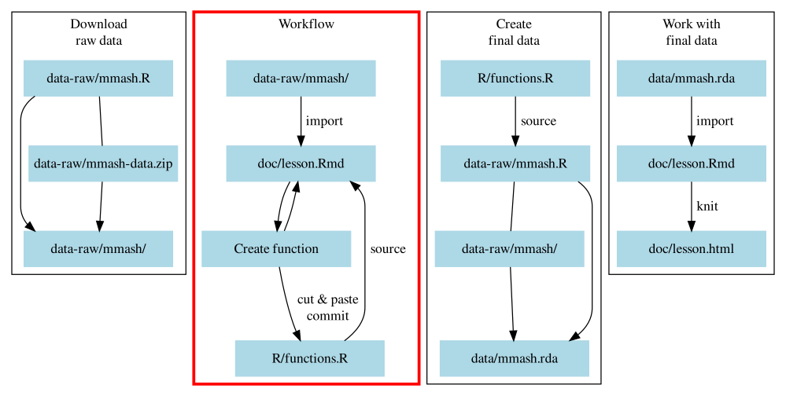

# Save time, don't repeat yourself: Making functions {#dry-functions}

```{r setup-03, include=FALSE, eval=FALSE}
source("R/functions.R")
source_session("02-importing.Rmd")
user_1_info_file <- here("data-raw/mmash/user_1/user_info.csv")
```

Here we will cover the second block, "*Workflow*" in Figure \@ref(fig:diagram-overview-2).

```{r diagram-overview-2, fig.cap="Section of the overall workflow we will be covering.", echo=FALSE}

```

And your folder and file structure should look like:

```
LearnR3
├── data/
│   └── README.md
├── data-raw/
│   ├── mmash-data.zip
│   ├── mmash/
│   │  ├── user_1
│   │  ├── ...
│   │  └── user_22
│   └── mmash.R
├── doc/
│   ├── README.md
│   └── lesson.Rmd
├── R/
│   ├── functions.R
│   └── README.md
├── .gitignore
├── DESCRIPTION
├── LearnR3.Rproj
└── README.md
```

## Learning objectives

1. Learn what functions are in R and how to create and use them.
1. Learn a workflow of using R Markdown, `source()` (or
`Ctrl-Shift-S` in RStudio), and restarting R (`Ctrl-Shift-F10`) 
as a tool and process for developing functions that can be later easily (re-)used.
1. Learn what R package dependency management is and how it can simplify your
data analysis work.
1. Debugging...
1. Continue practising Git version control to manage changes to your files.

## The basics of a function

**Take 5 min and read this section until it says to stop.**
As mentioned before, all actions in R are functions. For instance, the `+` is a
function, `mean()` is a function, `[]` is a function, and so on. Because R
is open source, that means anyone can see how things work underneath.
So, if we want to see what a function does underneath, we type out the
function name without the `()` into the Console and run it. 
If we do it with the function `sd()` which calculates the standard deviation,
we see:

```{r}
sd
```

How you calculate the standard deviation is the square root of the variance.
In this code, the `var()` is inside the `sqrt()` function, which is exactly what
it should be.

So, if you learn how to create your own functions, it can make doing your work
easier and more efficient because you don't have to repeat yourself later.
Making functions always has a basic structure of:

1. Giving a name to the function (e.g. `mean`).
2. Starting the function call using `function()`, assigning it to the name with
`<-`. This tells R that the name is a function object.
3. Optionally providing arguments to give to the function call, for instance
`function(argument1, argument2, argument3)`. 
4. Filling out the body of the function, with the arguments (if any) contained
inside, that does some action.
5. Optionally, use `return()` to indicate what you want the function to output.
For learning purposes, we'll always use `return()` to help show us what is the
final function output.

`r details_for_instructors("
Emphasize that we will be using this workflow for creating functions all the
time throughout course and that this workflow is also what you'd use in your
daily work.
")`

While there is no minimum or maximum number of arguments you can provide for a
function (e.g. you could have zero or dozens of arguments), its good practice
for yourself and for others to have as few arguments as necessary to get the job
done. So, the structure is:

```{r function-structure, eval=FALSE}
name <- function(argument1, argument2) {
    # body of function
    output <- ... code ....
    return(output)
}
```

Writing your own functions can be absolutely amazing and fun and powerful...
but you also often want to pull your hair out with frustration at errors that
are difficult to understand and fix. The best way to deal with this is by
debugging. Due to time and to the challenge of making meaningful debugging
exercises (solutions to problems are very dependent on the project), read 
Appendix \@ref(extra-material) in your own time for some instructions on
debugging and dealing with another common problem you might encounter with R.

**Ok, stop here and we'll go over it together**.
Let's write a simple example. First, create a new Markdown header called 
`## Making a function` and create a code chunk below that with `Ctrl-Alt-I`.
Then, inside the function, we'll write this code out:

```{r create-add-function}
add_numbers <- function(num1, num2) {
    added <- num1 + num2
    return(added)
}
```

You can use the new function by running the above code and writing out your new 
function, with arguments to give it.

```{r call-function}
add_numbers(1, 2)
```

The function name is fairly good... `add_numbers` is read as "add numbers".
While we generally want to write code that describes what it does by reading it,
it's also good practice to add some formal documentation to the function. Use
the "Insert Roxygen Skeleton" in the "Code" menu (or by typing
`Ctrl-Shift-Alt-R`) and you can add template documentation right above the
function. It looks like:

```{r roxygen-docs-1}
#' Title
#'
#' @param num1 
#' @param num2 
#'
#' @return
#' @export
#'
#' @examples
add_nums <- function(num1, num2) {
    added <- num1 + num2
    return(added)
}
```

In the `Title` area, this is where you type out a brief sentence or several words 
that describe the function. Creating a new paragraph below this line allows you 
to add a more detailed description. The other items are:

- `@param num`: These lines describe what each argument (also called parameter)
is for and what to give it.
- `@return`: This describes what output the function gives. Is it a data.frame?
A plot? What else does the output give?
- `@export`: Tells R that this function should be accessible to the user of your
package. Since we aren't making packages, delete it.
- `@examples`: Any lines below this are used to show examples of how to use the
function. This is very useful when making packages, but not really in this case.
So we'll delete it. Let's write out some documentation for this function:

```{r roxygen-docs-2}
#' Add two numbers together.
#'
#' @param num1 A number here.
#' @param num2 A number here.
#'
#' @return Returns the sum of the two numbers.
#'
add_nums <- function(num1, num2) {
    added <- num1 + num2
    return(added)
}
```

Once we've created that, let's open up the Git Interface (`Ctrl-Alt-M`) and **add
and commit** these changes to our history.

## Making a function for vroom

Now that we have a basic understanding of what a function looks like, let's
apply it to something we're doing right now: Importing our data.

Making functions is a series of steps:

1. Write code that works and does what you want.
1. Enclose it as a function with `name <- function() { ... }`, 
with an appropriate and descriptive name.
1. Create arguments in the function call (`function(argument1, argument2)`) with
appropriate and descriptive names, then replace the code with the argument names
where appropriate.
1. Rename any objects created to be more generic and include the `return()`
function at the end to indicate what the function will output.
1. Run the function and check that it works.
1. Add the Roxygen2 documentation tags (with `Ctrl-Alt-Shift-R` or "Code -> Insert
Roxygen Skeleton" menu item while the cursor is in the function).

`r details_for_instructors("
Emphasize that we will be using this workflow for creating functions all the
time throughout course and that this workflow is also what you'd use in your
daily work.
")`

So, step one. Let's take the code we wrote for importing the `user_info` data
and convert that as a function:

```{r function-creation-step-1, eval=FALSE}
user_1_info_data <- vroom(
    user_1_info_file,
    col_select = -1,
    col_types = cols(
        gender = col_character(),
        weight = col_double(),
        height = col_double(),
        age = col_double()
    ),
    .name_repair = snakecase::to_snake_case
)
```

Next we wrap it in the function call and give it an appropriate name. In this case,
`import_user_info` is descriptive and meaningful. Make sure to style it correctly
with `Ctrl-Shift-A`.

```{r function-creation-step-2, eval=FALSE}
import_user_info <- function() {
    user_1_info_data <- vroom(
        user_1_info_file,
        col_select = -1,
        col_types = cols(
            gender = col_character(),
            weight = col_double(),
            height = col_double(),
            age = col_double()
        ),
        .name_repair = snakecase::to_snake_case
    )
}
```

Then, we add arguments in the function and replace within the code. Here, we
have only one thing that we would change: The file path to the dataset.
So, a good name might be `file_path`.

```{r function-creation-step-3, eval=FALSE}
import_user_info <- function(file_path) {
    user_1_info_data <- vroom(
        file_path,
        col_select = -1,
        col_types = cols(
            gender = col_character(),
            weight = col_double(),
            height = col_double(),
            age = col_double()
        ),
        .name_repair = snakecase::to_snake_case
    )
}
```

Then we clean things up by renaming `user_1_info_data` since we would like to
also import more than just `user_1`. A nice object name would be `info_data`. 
Add the `return()` function at the end with the object you want your function to
output.

```{r function-creation-step-4}
import_user_info <- function(file_path) {
    info_data <- vroom(
        file_path,
        col_select = -1,
        col_types = cols(
            gender = col_character(),
            weight = col_double(),
            height = col_double(),
            age = col_double(),
        ),
        .name_repair = snakecase::to_snake_case
    )
    return(info_data)
}
```

Great! Now we need to test it out. Let's try on two datasets, 
two `user_info.csv` files in the `user_1` and `user_2` folders.

```{r function-creation-step-5}
import_user_info(here("data-raw/mmash/user_1/user_info.csv"))
import_user_info(here("data-raw/mmash/user_2/user_info.csv"))
```

Awesome! It works. The final stage is adding the Roxygen documentation.

```{r function-creation-step-6}
#' Import MMASH user info data file.
#'
#' @param file_path Path to user info data file.
#'
#' @return Outputs a data frame/tibble.
#'
import_user_info <- function(file_path) {
    info_data <- vroom(
        file_path,
        col_select = -1,
        col_types = cols(
            gender = col_character(),
            weight = col_double(),
            height = col_double(),
            age = col_double(),
        ),
        .name_repair = snakecase::to_snake_case
    )
    return(info_data)
}
```

A massive advantage of using functions is that if you want to make a change to all
your code, you can very easily do it by modifying the function and it will
change all your other code too. Now that we have a working function, let's **add
and commit** it to the Git history with the RStudio Git Interface.

## Exercise: Repeat with the saliva data

Time: 15 min

Take the code you created for importing the saliva data set from 
Exercise \@ref(ex-import-saliva) and make it into a function. A helpful tip:
To move around an R Markdown or R script more easily, open up the 
"Document Outline" on the side by clicking the button in the top right corner of
the R Markdown pane or by using `Ctrl-Shift-O`.

1. Create a new markdown header `## Exercise for importing the saliva data as a function`.
1. Create a new code chunk below that (`Ctrl-Alt-I`).
1. Paste the code you used from the exercise into the code chunk and begin
converting it into a function, like we did above.
    - Wrap it with the `function() {...}`
    - Make a meaningful name (e.g. `import_saliva`)
    - Make an argument for the file path and replace it with the code in `vroom()`
    - Rename the output object and include it in the `return()` function
    - Test that it works
    - Create the Roxygen documentation

```{r solution-repeat-saliva, results='hide', solution=TRUE}
#' Import the MMASH saliva dataset.
#'
#' @param file_path Path to the user saliva data file.
#'
#' @return Outputs a data frame/tibble.
#'
import_saliva <- function(file_path) {
    saliva_data <- vroom(
        file_path,
        col_select = -1,
        col_types = cols(
            samples = col_character(),
            cortisol_norm = col_double(),
            melatonin_norm = col_double()
        ),
        .name_repair = snakecase::to_snake_case
    )
    return(saliva_data)
}
```

## Continuing the workflow

We've created two functions. Now we need to move those functions from the 
`doc/lesson.Rmd` file and into the `R/` folder. We do this for a few reasons:

1. To prevent the R Markdown document from becoming too long and having a large
portion of R code over other text.
1. To make it easier to maintain and find things in your project.
1. To make use of the `source()` function.

We want to store our functions in the file `R/functions.R` script so its easier
to source them. Cut and paste *only* the
`import_user_info()` function we created in `doc/lesson.Rmd`, including the
Roxygen documentation, and paste it into the newly created `R/functions.R`.

Once we have it in there, let's test out the workflow.
Restart our R session with either `Ctrl-Shift-F10` or from the 
"Session -> Restart R" menu item. Move back into the `doc/lesson.Rmd`
and add `source(here("R/functions.R"))` to the code chunk called `setup` at the top.
Run that line of code. Then go to where you wrote:

```{r, eval=FALSE}
import_user_info(here("data-raw/mmash/user_1/user_info.csv"))
```

Now run this line. What happens now? You *may* get an error about
not finding the `vroom()` function. If you put `library(vroom)` in the `setup`
code chunk, you might not get an error. If you did get an error,
that's because R doesn't know what the `vroom()` function is. This is where we
start getting into package dependency management.

What is package dependency management? Whenever you use an R package, you 
depend on it for your code to work. The informal way to show what packages you use
is by using the `library()` function. But if you come back to the project, 
or get a new computer, or someone else is working on your project too,
how will they know which packages your project depends on?
Do they have to search through all your files just to find all `library()`
functions you used and then install those packages individually? A much better
way here is to formally indicate your package dependency so that installing
dependencies is easy. We do this by making use of the `DESCRIPTION` file.

Open up the `DESCRIPTION` file. You may or may not see something that looks like:

```text
Package: LearnR3
Type: Project
Version: 0.0.1
Imports:
    knitr,
    rmarkdown,
    distill
Encoding: UTF-8
```

If it doesn't look like this, replace all of your current text with the text above.
Notice the `Imports:` key. This is where information about packages are added.
To quickly add a package, go to the **Console** and type out:

```r
usethis::use_package("vroom")
```

You will see a bunch of text about adding it to `Imports`. If you look in your
`DESCRIPTION` file now, you'll see something like:

```text
Imports: 
    knitr,
    rmarkdown,
    distill,
    usethis
```

Now, if you or someone else wants to install all the packages your project
depends on, they can do that by going to the **Console** and running:

```r
remotes::install_deps()
```

This function finds the `DESCRIPTION` file and installs all the packages in
`Imports`. Let's add the other dependencies by typing in the **Console**:

```r
usethis::use_package("here")
usethis::use_package("fs")
usethis::use_package("snakecase")
```

Since we will also make use of the tidyverse set of packages later in the
course, we'll also add tidyverse as a dependency. Since the tidyverse is a large
collection of packages, the recommended way to add this particular dependency is
with:

```r
usethis::use_package("tidyverse", type = "Depends")
```

If you look in the `DESCRIPTION` file now, you see that the new `Depends` field 
has been added with `tidyverse` right below it. There are fairly technical
reasons why we need to put tidyverse in the `Depends` field that you don't need 
to know about for this course, aside from the fact that it is a common practice
in R projects. At least in this context, we use the `Depends` field for
tidyverse because of one big reason: the `usethis::use_package()` function will
complain if we try to put tidyverse in the `Imports` and it recommends putting
it in the `Depends` field.

```text
Depends: 
    tidyverse
```

Great! Now that we've formally established package dependencies in our project,
we also need to formally declare which package each function comes from inside
our own functions. Before getting into the correct way, we need to quickly cover
the incorrect way that you may or may not have seen how others have done it on
websites or in script files. Sometimes people use `library()` or `require()`
inside functions like:

```{r bad-practice-library, eval=FALSE}
add_numbers <- function(num1, num2) {
    library(packagename)
    ...code...
    return(added)
}
```

Or: 

```{r bad-practice-require, eval=FALSE}
add_numbers <- function(num1, num2) {
    require(packagename)
    ...code...
    return(added)
}
```

This is *very* **bad practice** and can have some unintended and serious
consequences that you might not notice or that won't give any warning or error.
The correct way of indicating which package a function comes from is instead by
using `packagename::`, which you've seen and used many times in this course.
We won't get into the reasons why this is incorrect because it can quickly get
quite technical.

```{r, echo=FALSE, results='asis'}
details_for_instructors("
You can also talk about why `require()` shouldn't be used compared to `library()`.
The problem with `require()` is that if the package can't be loaded, it won't
throw an error, it only *checks* if the package is available and will otherwise
continue running the code. On the other hand, `library()` will throw an error if
it can't find the package, which is what you expect if your code depends on a
package.
")
```

Another reason to use `packagename::` for each function from an R package
you use in your own function is that it explicitly tells R (and us the readers)
where the function comes from. Because the same function name can be used by
multiple packages, if you don't explicitly state which package the function is 
from, R will use the function that it finds first... which isn't always the
function you meant to use.

We also do this step at the end of making the function because doing it while
we create it can be quite tedious. Alright, let's go into `R/functions.R` and
add `vroom::` to each of the vroom functions we've used:

```{r explicit-function-calls}
import_user_info <- function(file_path) {
    info_data <- vroom::vroom(
        file_path,
        col_select = -1,
        col_types = vroom::cols(
            gender = vroom::col_character(),
            weight = vroom::col_double(),
            height = vroom::col_double(),
            age = vroom::col_double()
        ),
        .name_repair = snakecase::to_snake_case
    )
    return(info_data)
}
```

Test that it works by restart the R session (`Ctrl-Shift-F10` or "Session ->
Restart R") and source the file with `Ctrl-Shift-S`, then go to the
**Console** and type out:

```r
import_user_info(here::here("data-raw/mmash/user_1/user_info.csv"))
```

It should work as expected!
Now that we've done that, let's **add and commit** the changes made through the
Git interface.

## Exercise: Move and update the rest of the functions

Time: 20 min

Repeat this process of making functions by doing this to the rest of the code
you worked on previously that imported the `RR.csv` and `Actigraph.csv` data.

1. Convert the importing code into functions while in the `doc/lessons.Rmd` file.
Include the Roxygen documentation and use `packagename::` to be explicit about
where the function comes from.
    - Name the new functions `import_rr` and `import_actigraph`.
1. Move the function into `R/functions.R`.
1. Restart R, `source()` the functions file (`Ctrl-Shift-S`), and
test that the functions work by running them in the **Console**.

Also update the `import_saliva()` function you created by being explicit about
where the functions come from (e.g. with the `packagename::`).

```{r solution-update-other-functions, results='hide', solution=TRUE}
#' Import the MMASH saliva dataset.
#'
#' @param file_path Path to the user saliva data file.
#'
#' @return Outputs a data frame/tibble.
#'
import_saliva <- function(file_path) {
    saliva_data <- vroom::vroom(
        file_path,
        col_select = -1,
        col_types = vroom::cols(
            samples = vroom::col_character(),
            cortisol_norm = vroom::col_double(),
            melatonin_norm = vroom::col_double()
        ),
        .name_repair = snakecase::to_snake_case
    )
    return(saliva_data)
}

#' Import the MMASH RR dataset (heart beat-to-beat interval).
#'
#' @param file_path Path to the user RR data file.
#'
#' @return Outputs a data frame/tibble.
#'
import_rr <- function(file_path) {
    rr_data <- vroom::vroom(
        file_path,
        col_select = -1,
        col_types = vroom::cols(
            ibi_s = vroom::col_double(),
            day = vroom::col_double(),
            # Converts to seconds
            time = vroom::col_time(format = "")
        ),
        .name_repair = snakecase::to_snake_case
    ) 
    return(rr_data)
}

#' Import the MMASH Actigraph dataset (accelerometer).
#'
#' @param file_path Path to the user Actigraph data file.
#'
#' @return Outputs a data frame/tibble.
#'
import_actigraph <- function(file_path) {
    actigraph_data <- vroom::vroom(
        file_path,
        col_select = -1,
        col_types = vroom::cols(
            axis_1 = vroom::col_double(),
            axis_2 = vroom::col_double(),
            axis_3 = vroom::col_double(),
            steps = vroom::col_double(),
            hr = vroom::col_double(),
            inclinometer_off = vroom::col_double(),
            inclinometer_standing = vroom::col_double(),
            inclinometer_sitting = vroom::col_double(),
            inclinometer_lying = vroom::col_double(),
            vector_magnitude = vroom::col_double(),
            day = vroom::col_double(),
            time = vroom::col_time(format = "")
        ),
        .name_repair = snakecase::to_snake_case
    )
    return(actigraph_data)
}
```
