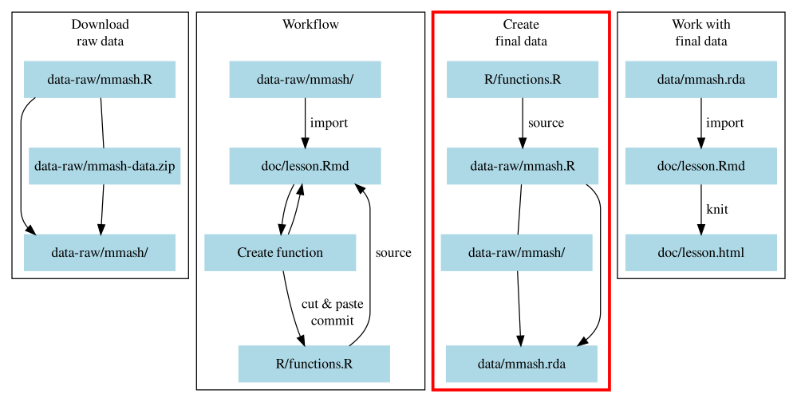

# Save time, don't repeat yourself: Using functionals {#dry-functionals}

```{r setup-04, include=FALSE, eval=FALSE}
source("R/functions.R")
library(here)
library(fs)
library(tidyverse)
library(vroom)
source_session("03-functions.Rmd")
```

We will continue covering the "*Workflow*" block in Figure \@ref(fig:diagram-overview-3).

```{r diagram-overview-3, fig.cap="Section of the overall workflow we will be covering.", echo=FALSE}

```

And your folder and file structure should look like:

```
LearnR3
├── data/
│   └── README.md
├── data-raw/
│   ├── mmash-data.zip
│   ├── mmash/
│   │  ├── user_1
│   │  ├── ...
│   │  └── user_22
│   └── mmash.R
├── doc/
│   ├── README.md
│   └── lesson.Rmd
├── R/
│   ├── functions.R
│   └── README.md
├── .gitignore
├── DESCRIPTION
├── LearnR3.Rproj
└── README.md
```

## Learning objectives

1. Learn about and apply functional programming, vectorization, and functionals
within R.
1. Review the split-apply-combine technique and understand the link with functional
programming.
1. Apply functional programming to summarizing data and for using the 
split-apply-combine technique.

## Functional programming

**Please take 15 min to read over this section before we continue.**
Unlike many other programming languages, R's primary strength and approach to
programming is in functional programming. So what is it? It is programming that:

- Uses functions (like `function()`)
- Applies functions to vectors all at once (called [vectorisation]), rather than
in a loop
- Can use functions as input to other functions (called a [functional])

[vectorisation]: https://bookdown.org/rdpeng/rprogdatascience/vectorized-operations.html
[functional]: https://adv-r.had.co.nz/Functionals.html

We've already covered functions. You've definitely already used vectorization
since it is one of R's big strengths. For instance, functions like `mean()`,
`sd()`, `sum()` are vectorized in that you give them a vector of numbers and they
do something to all the values in the vector at once. As a comparison, in other
programming languages, if you wanted to calculate the sum you would need a loop:

```{r using-for-loop}
total_sum <- 0
# a vector
values <- 1:10
for (value in values) {
    total_sum <- value + total_sum
}
total_sum
```

But in R, you can give a function that uses vectorization the entire vector
(e.g. `c(1, 2, 3, 4)`) and R will know what to do with it. 
Figure \@ref(fig:image-vectorization) shows how a function conceptually uses
vectorization.

```{r image-vectorization, fig.cap="A function using vectorization. Modified from the [RStudio purrr cheatsheet][purrr-cheatsheet].", out.width="40%", echo=FALSE}
knitr::include_graphics(here::here("images/vectorization.png"))
```

Instead, in R, there is the function called `sum()` that takes the entire
vector of `values` and outputs the total sum, without needing a for loop.

```{r}
# Vectorized
sum(values)
```

[purrr-cheatsheet]: https://raw.githubusercontent.com/rstudio/cheatsheets/master/purrr.pdf

A functional on the other hand is a function that can also use a function as
one of its arguments. Figure \@ref(fig:image-functionals) shows how the functional
`map()` from the [purrr] package works by taking a vector (or list), applying a 
function to each of those items, and outputting the results from each function.
The name `map()` doesn't mean a geographic map, it is the mathematical meaning
of map: To use a function on each item in a set of items.

```{r image-functionals, fig.cap="A functional that uses a function to apply it to each item in a vector. Modified from the [RStudio purrr cheatsheet][purrr-cheatsheet].", out.width="75%", echo=FALSE}
knitr::include_graphics(here::here("images/functionals.png"))
```

[purrr]: https://purrr.tidyverse.org

Here's a simple toy example to show how it works. We'll use `paste()` on each
item of `1:5`.

```{r}
library(purrr)
map(1:5, paste)
```

You'll notice that `map()` outputs a list, with all the `[[1]]` printed. `map()`
will always output a list. Also notice that the `paste()` function is given 
*without* the `()` brackets. Without the brackets, the function can be used
by the `map()` functional and treated like any other object in R. 

Let's say we wanted to paste together the number with the sentence "seconds have
passed". Normally it would look like:

```{r paste-multiple}
paste(1, "seconds have passed")
paste(2, "seconds have passed")
paste(3, "seconds have passed")
paste(4, "seconds have passed")
paste(5, "seconds have passed")
```

Or as a loop:

```{r paste-loop}
for (num in 1:5) {
    sec_passed <- paste(num, "seconds have passed")
    print(sec_passed)
}
```

With `map()`, we'd do this a bit differently. purrr uses a shortcut to allow
you to write functions that do more things to the input vector (e.g. `1:5`).
This shortcut is using `~` to start the function and `.x` as the replacement
for the vector item:

```{r}
map(1:5, ~paste(.x, "seconds have passed"))
```

This is the basics of using functionals. Functions, vectorization, and
functionals provide expressive and powerful approaches to a simple task:
*Doing an action on each item in a set of items*. And while technically using a
for loop lets you "not repeat yourself", they tend to be more error prone
and harder to write and read compared to these other tools.

But what does functionals have to do with what we are doing now? Well, our 
`import_user_info()` function only takes in one data file. But we have 
22 files that we could load all at once if we used functionals.
**Ok, stop reading and we'll go over this again before continuing with the
coding.**

`r details_for_instructors("
Go over this section briefly by reinforcing what they read. Make sure they
understand the concept of applying something to many things at once. Doing the
code-along should also help reinforce this concept. 

Also highlight that the resources appendix has some links for continued learning
for this and that the RStudio purrr cheatsheet is an amazing resource to use.
")`

The first thing we have to do is add `library(purrr)` to the `setup` code chunk
in the `doc/lesson.Rmd` document. Then we need to add the package dependency
by going to the *Console* and running:

```r
usethis::use_package("purrr")
```

Then, the next step for using the `map()` functional is to get a vector
or list of all the dataset files available to us. We will return to using the fs
package, which has a function called `dir_ls()` that finds files of a certain
pattern. In our case, the pattern is `user_info.csv`. So, let's add `library(fs)`
to the `setup` code chunk. Then, go to the bottom of the `doc/lesson.Rmd`
document, create a new header called `## Using map`, and create a code chunk
below that.

The `dir_ls()` function takes the path that we want to search (`data-raw/mmash/`),
uses the argument `regexp` (short for [regular expression][regex] or also `regex`) to find the pattern,
and `recurse` to look in all subfolders. We'll cover regular expressions
more in the next session.

[regex]: https://r4ds.had.co.nz/strings.html#matching-patterns-with-regular-expressions

```{r list-user-info-files}
user_info_files <- dir_ls(here("data-raw/mmash/"), 
                          regexp = "user_info.csv", 
                          recurse = TRUE)
```

Then let's see what the output looks like. For the website, we are only showing
the first 3 files. Your output will look slightly different from this.

```{r list-files-head, eval=FALSE}
user_info_files
```

```{r list-files-for-book, echo=FALSE}
head(gsub(".*\\/data-raw", "data-raw", user_info_files), 3)
```

Alright, we now have all the files ready to give to `map()`. So let's try it!

```{r}
user_info_list <- map(user_info_files, import_user_info)
```

Remember, that `map()` always outputs a list, so when we look into this object,
it will give us 22 tibbles (data.frames). Here we'll only show the first one:

```{r}
user_info_list[[1]]
```

This is great because with one line of code we imported all these datasets!
But we're missing an important bit of information: The user ID. 
A powerful feature of the purrr package is that it has other functions to
make working with functionals easier. We know `map()` always outputs a list.
What if you want to output a character vector instead? If we check the help:

```r
?map
```

`r details_for_instructors("Go through this help documentation and talk a bit about it.")`

We see that there are other functions, including a function
called `map_chr()` that seems to output a character vector. 
There are several others that give an output based 
on the ending of `map_`, such as:

- `map_int()` outputs an integer.
- `map_dbl()` outputs a numeric value, called a "double" in programming.
- `map_dfr()` outputs a data frame, combining the list items by row (`r`).
- `map_dfc()` outputs a data frame, combining the list items by column (`c`).

The `map_dfr()` looks like the one we want, since we want all these datasets
together as one. If we look at the help for it,
we see that it has an argument `.id`, which we can use to create a new column
that sets the user ID, or in this case, the file path to the dataset, which
has the user ID information in it. So, let's use it and create a new column
called `file_path_id`.

```{r}
user_info_df <- map_dfr(user_info_files, import_user_info,
                        .id = "file_path_id")
```

Your `file_path_id` variable will look different. Don't worry, we're going to
tidy up the `file_path_id` variable later.

```{r, eval=FALSE}
user_info_df
```

```{r show-data-for-book, echo=FALSE}
user_info_df %>% 
    trim_filepath_for_book()
```

Now that we have this working, let's add and commit the changes to the Git history.

## Exercise: Make a function for importing other datasets with functionals {#ex-function-import-all-data}

Time: 20 min

We need to do basically the exact same thing for the `saliva.csv`, `RR.csv`, and
`Actigraph.csv` datasets, following this format:

```{r ex-template, eval=FALSE}
user_info_files <- dir_ls(here("data-raw/mmash/"), 
                          regexp = "user_info.csv", 
                          recurse = TRUE)
user_info_df <- map_dfr(user_info_files, import_user_info,
                        .id = "file_path_id")
```

For importing the other datasets, we basically only have to modify two locations
to get this code to import the other datasets: at the `regexp =` argument and
where the `import_user_info` function is. This is the perfect chance to make a
function that you can use for other purposes and that is itself a functional
(since it takes a function as an input). So inside `doc/lesson.Rmd`, convert
this bit of code into a function that works to import the other three datasets.

1. Create a new header `## Exercise: Map on the other datasets` at the bottom of
the document.
1. Create a new code chunk below it.
1. Repeat the steps you've taken previously to create a new function:
    - Wrap the code with `function() { ... }`
    - Name the function `import_multiple_files`
    - Create two new arguments called `file_pattern` and `import_function`
    - Create generic intermediate objects (instead of `user_info_file` and
    `user_info_df`). We'd recommend something like `data_files` and
    `combined_data`
    - Use `return()` at the end of the function for the object you want to output
    - Create and write Roxygen documentation to describe the new function
    - Append `packagename::` to the individual functions (there are three packages
    used: fs, here, and purrr)
    - Run it and check that it works on `saliva.csv`
1. After it works, cut and paste the function into the `R/functions.R` file.
Then restart the R session, run the line with `source(here("R/functions.R"))`, 
and test the code out in the *Console*.
1. Then, write code in your `doc/lesson.Rmd` file where the function used to be
and import in the other datasets. You should now have three new objects for all
the imported datasets, called `saliva_df`, `rr_df`, and `actigraph_df`.
1. Once done, add the changes you've made and commit them to the Git history.

```{r solution-import-multiple-files, results='hide', solution=TRUE}
#' Import multiple MMASH data files and merge into one data frame.
#'
#' @param file_pattern Pattern for which data file to import.
#' @param import_function Function to import the data file.
#'
#' @return A single data frame/tibble.
#'
import_multiple_files <- function(file_pattern, import_function) {
    data_files <- fs::dir_ls(here::here("data-raw/mmash/"),
                             regexp = file_pattern,
                             recurse = TRUE)
    
    combined_data <- purrr::map_dfr(data_files, import_function,
                                    .id = "file_path_id")
    return(combined_data)
}

# Try on saliva
import_multiple_files("saliva.csv", import_saliva)
```

## Exercise: What is the pipe?

Time: 5 min

`r details_for_instructors("
Before starting this exercise, ask how many have used the pipe before.
If everyone has, then move on to the next section.
")`

We haven't used the `%>%` pipe from the [magrittr] package yet, but it is used
extensively in many R packages and is the foundation of tidyverse packages.
The function fundamentally changed how people write R code so much that
in version 4.1 a similar function, `|>`, was added to base R. To make sure
everyone is aware of what the pipe is, in your groups please do either task:

[magrittr]: https://magrittr.tidyverse.org/

- If one or more person in the group doesn't know what the pipe is, take some
time to talk about and explain it (if you know).
- If no one in the group knows, please read 
[the section on it](https://r-cubed.rostools.org/wrangling.html#chaining-functions-with-the-pipe)
from the beginner course.

## Split-apply-combine technique and functionals

`r details_for_instructors("
Verbally cover this section before moving on to the summarizing. Let them know 
they can read more about this in this section.
")`

We're taking a quick detour to briefly talk about a concept that perfectly
illustrates how vectorization and functionals fit into doing data analysis.
The concept is called the
[split-apply-combine](https://r-cubed.rostools.org/wrangling.html#split-apply-combine-summarizing-data)
technique, which we covered in the beginner R course.
The method is:

1. Split the data into groups (e.g. diabetes status).
2. Apply some analysis or statistics to each group (e.g. finding the mean of age).
3. Combine the results to present them together (e.g. into a data frame that you can use
to make a plot or table).

So when you split data into multiple groups, you make a *vector* that you can 
than apply (i.e. the *map* functional) some statistical technique to each group
through *vectorization*. This technique works really well for a range of tasks, 
including for our task of summarizing some of the MMASH data so we can merge
it all into one dataset.

## Summarising data through functionals {#summarise-with-functionals}

Functionals and vectorization are an integral component of how R works and
they appear throughout many of R's functions and packages. They are particularly
used throughout the tidyverse packages like [dplyr]. Let's get into some more
advanced features of dplyr functions that work as functionals.

[dplyr]: https://dplyr.tidyverse.org/

There are many "verbs" in dplyr, like `select()`, `rename()`, `mutate()`, 
`summarise()`, and `group_by()` (covered in more detail in the 
[Data Management and Wrangling](https://r-cubed.rostools.org/wrangling.html#managing-and-working-with-data-in-r)
session of the beginner course).
The common usage of these verbs is through acting on and directly using the
column names (e.g. without `"` quotes around the column name). For instance, to
select only the `age` column, you would type out:

```{r}
user_info_df %>% 
    select(age)
```

But many dplyr verbs can also take functions as input. When you combine `select()`
with the `where()` function, you can select e.g. columns that are numeric:

```{r}
user_info_df %>% 
    select(where(is.numeric))
```

Or, only character columns:

```{r}
user_info_df %>% 
    select(where(is.character))
```

Likewise, with functions like `summarise()`,
if you want to e.g. calculate the mean of a column, you would usually type out:

```{r}
saliva_df <- import_multiple_files("saliva.csv", import_saliva)
saliva_df %>% 
    summarise(cortisol_mean = mean(cortisol_norm))
```

If you want to calculate the mean of multiple columns, you might think you'd have
to do something like:

```{r}
saliva_df %>% 
    summarise(cortisol_mean = mean(cortisol_norm),
              melatonin_mean = mean(melatonin_norm))
```

But instead, there is the `across()` function that works like `map()` and allows
you to calculate the mean across which ever columns you want. In many ways,
`across()` is a duplicate of `map()`, particularly in the arguments you give 
it. 

**Take 2 min and read through this list**. When you look in `?across`, there are
two main arguments and two optional ones:

1. `.cols` argument: Columns you want to use. 
    - Write column names directly and wrapped in `c()`: `c(age, weight)`.
    - Write `tidyselect` helpers: `everything()`, `starts_with()`,
    `contains()`, `ends_with()`
    - Use a function wrapped in `where()`: `where(is.numeric)`,
    `where(is.character)`
2. `.fns`: The function to use on the `.cols`.
    - A bare function (`mean`) applies it to each column and returns the output,
    with the column name unchanged.
    - A list with bare functions (`list(mean, sd)`) applies each function to
    each column and returns the output with the column name appended with a 
    number (e.g. `cortisol_norm_1`).
    - A named list with bare functions (`list(average = mean, stddev = sd)`)
    does the same as above but instead returns an output with the column names
    appended with the name given to the function in the list (e.g. `cortisol_norm_average`).
    - A function passed with `~` and `.x`, like in `map()`. For instance,
    `across(c(age, weight), ~ mean(.x, na.rm = TRUE))` is used to say "put age
    and weight, one after the other, in place of where `.x` is located" to 
    calculate the mean for age and the mean for weight.
3. `...` argument: Arguments to give to the functions in `.fns`. For instance,
`across(age, mean, na.rm = TRUE)` passes the argument to remove missingness
`na.rm` into the `mean()` function.
4. `.names` argument: Customize the output of the column names. We won't cover 
this argument.

**Ok, stop reading and we'll cover this together**.

`r details_for_instructors("
Go over the first two arguments again, reinforcing what they read.
")`

Let's try out some examples. To calculate the mean of `cortisol_norm` like we did
above, we'd do:

```{r}
saliva_df %>% 
    summarise(across(cortisol_norm, mean))
```

To calculate the mean of another column:

```{r}
saliva_df %>% 
    summarise(across(c(cortisol_norm, melatonin_norm), mean))
```

This is nice, but changing the column names so that the function name is added 
would make reading what the column contents are clearer. That's when we would
use "named lists", which are lists that look like:

```r
list(item_one_name = ..., item_two_name = ...)
```

So, for having a named list with mean inside `across()`, it would look like:

```r
list(mean = mean)
# or
list(average = mean)
# or
list(ave = mean)
```

You can confirm that it is a list by using the function `names()`:

```{r}
names(list(mean = mean))
names(list(average = mean))
names(list(ave = mean))
```

Let's stick with `list(mean = mean)`:
    
```{r}
saliva_df %>% 
    summarise(across(cortisol_norm, list(mean = mean)))
```
    
If we wanted to do that for all numeric columns and also calculate `sd()`:

```{r}
saliva_df %>% 
    summarise(across(where(is.numeric), list(mean = mean, sd = sd)))
```

We can use these concepts and code to process the other longer datasets, like
`RR.csv`, in a way that makes it more meaningful to eventually merge (also
called "join") them with the smaller datasets like `user_info.csv` or
`saliva.csv`. Let's work with the `RR.csv` dataset to eventually join it with
the others.

With the RR dataset, each participant had almost 100,000 data points recorded
over two days of collection. So if we want to join with the other datasets,
we need to calculate summary measures by at least `file_path_id` and also preferably
by `day` as well. In this case, we need to `group_by()` these two variables
before summarising that lets us use the split-apply-combine technique. Let's
first summarise by taking the mean of `ibi_s` (which is the inter-beat interval
in seconds):

```{r rr-summarised, eval=FALSE}
rr_df <- import_multiple_files("RR.csv", import_rr)
rr_df %>% 
    group_by(file_path_id, day) %>% 
    summarise(across(ibi_s, list(mean = mean)))
```

```{r rr-summarised-for-book, echo=FALSE}
rr_df <- import_multiple_files("RR.csv", import_rr)
rr_df %>% 
    group_by(file_path_id, day) %>% 
    summarise(across(ibi_s, list(mean = mean))) %>% 
    trim_filepath_for_book()
```

While there are no missing values here, let's add the argument `na.rm = TRUE`
just in case.

```{r rr-summarise-na-rm, eval=FALSE}
rr_df %>% 
    group_by(file_path_id, day) %>% 
    summarise(across(ibi_s, list(mean = mean), na.rm = TRUE))
```

```{r rr-summarise-na-rm-for-book, echo=FALSE}
rr_df %>% 
    group_by(file_path_id, day) %>% 
    summarise(across(ibi_s, list(mean = mean), na.rm = TRUE)) %>% 
    trim_filepath_for_book()
```

You might notice a message (depending on the version of dplyr you have):

```text
`summarise()` regrouping output by 'file_path_id' (override with `.groups` argument)
```

**Take 5 min to read this section over before we continue**.
This message talks about regrouping, and overriding based on the `.groups`
argument. If we look in the help `?summarise`, at the `.groups` argument, we see that
this argument is currently "experimental". At the bottom there is a message about:

> In addition, a message informs you of that choice, unless the option
"dplyr.summarise.inform" is set to FALSE, or when summarise() is called from a
function in a package.

So how would be go about removing this message? By putting the
"dplyr.summarise.inform" in the `options()` function. So, go to the `setup` code
chunk at the top of the document and add this code to the top:

```{r}
options(dplyr.summarise.inform = FALSE)
```

You will now no longer get the message. 
**Please stop reading and we will continue together**.

Let's also add standard deviation as another measure from the RR datasets:

```{r rr-summarise-as-object, eval=FALSE}
summarised_rr_df <- rr_df %>% 
    group_by(file_path_id, day) %>% 
    summarise(across(ibi_s, list(mean = mean, sd = sd), na.rm = TRUE))
summarised_rr_df
```

```{r rr-summarise-as-object-for-book, echo=FALSE}
summarised_rr_df <- rr_df %>% 
    group_by(file_path_id, day) %>% 
    summarise(across(ibi_s, list(mean = mean, sd = sd), na.rm = TRUE))
summarised_rr_df %>% 
    trim_filepath_for_book()
```

Whenever you are finished with a grouping effect, it's good practice to end 
the `group_by()` with `ungroup()`. Let's add it to the end:

```{r rr-summarise-ungroup, eval=FALSE}
summarised_rr_df <- rr_df %>% 
    group_by(file_path_id, day) %>% 
    summarise(across(ibi_s, list(mean = mean, sd = sd), na.rm = TRUE)) %>% 
    ungroup()
summarised_rr_df
```

```{r rr-summarise-ungroup-for-book, echo=FALSE}
summarised_rr_df <- rr_df %>% 
    group_by(file_path_id, day) %>% 
    summarise(across(ibi_s, list(mean = mean, sd = sd), na.rm = TRUE)) %>% 
    ungroup()
summarised_rr_df %>% 
    trim_filepath_for_book()
```

Before continuing, switch to the Git interface and add and commit the changes so
far.

## Exercise: Summarise the Actigraph data

Time: 20 min

Like with the `RR.csv` dataset, let's process the `Actigraph.csv` dataset so 
that it makes it easier to join with the other datasets later.

1. Like usual, create a new Markdown header called e.g. `## Exercise: Summarise 
Actigraph` and insert a new code chunk below that.
2. Import all the Actigraph data files using the `import_multiple_files()` function
you created previously. Name the new data frame `actigraph_df`.
3. Look into the [Data Description][mmash-site] to find out what each column 
is for.
4. Based on the documentation, which variables would you be most interested in
analyzing more?
    - Keep those columns as well `file_path_id` and `day` by using `select()`.
5. Decide which summary measure(s) you think may be most interesting for you
(e.g. `median()`, `sd()`, `mean()`, `max()`, `min()`, `var()`).
6. Using `group_by()` of `file_path_id` and `day`, summarise the variables with the
summary functions you chose. Name the summarised data frame `summarised_actigraph_df`.
7. End the grouping effect with `ungroup()`.
8. Add and commit the changes you've made into the Git history.

```{r solution-summarise-actigraph, results='hide', solution=TRUE}
actigraph_df <- import_multiple_files("Actigraph.csv", import_actigraph)
summarised_actigraph_df <- actigraph_df %>% 
    group_by(file_path_id, day) %>% 
    # These statistics will probably be different for you
    summarise(across(hr, list(mean = mean, sd = sd), na.rm = TRUE)) %>% 
    ungroup()
```


