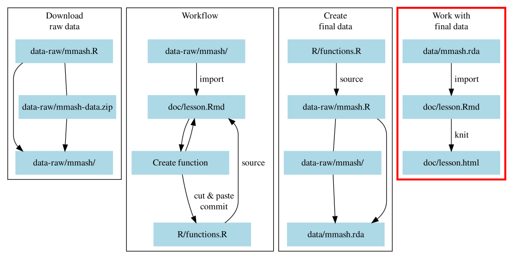

# Quickly re-arranging data with pivots {#pivots}

```{r setup-06, include=FALSE, eval=FALSE}
# Used this only during writing to run code dependent on previous chapters.
source("R/functions.R")
library(here)
library(fs)
library(tidyverse)
library(vroom)
source_session("03-functions.Rmd")
source_session("04-functionals.Rmd")
source_session("05-dplyr-joins.Rmd")
load(here("data/mmash.rda"))
```

Here we will continue using the *Workflow* block as we cover the fourth block,
"*Work with final data*" in Figure \@ref(fig:diagram-overview-4).

```{r diagram-overview-5, fig.cap="Section of the overall workflow we will be covering.", echo=FALSE}

```

And your folder and file structure should look like:

```
LearnR3
├── data/
│   ├── mmash.rda
│   └── README.md
├── data-raw/
│   ├── mmash-data.zip
│   ├── mmash/
│   │  ├── user_1
│   │  ├── ...
│   │  └── user_22
│   └── mmash.R
├── doc/
│   ├── README.md
│   └── lesson.Rmd
├── R/
│   ├── functions.R
│   └── README.md
├── .Rbuildignore
├── .gitignore
├── DESCRIPTION
├── LearnR3.Rproj
└── README.md
```

## Learning objectives

1. Using the concept of "pivoting" to arrange data from long to wide and vice versa.
1. 

## Setup for the analysis in R Markdown

We now have a working dataset to start doing some simple analyses on in the
R Markdown document. A recommended workflow with R Markdown is to often
"Knit" it and make sure your analysis is reproducible (while on your computer).
So let's first clean it up and start from the beginning again.

Before we do that, make sure to add and commit all changes done in `doc/lesson.Rmd`.
By keeping changes in the history, we can go back to look at it anytime.

Then, we'll delete everything from below the `setup` code chunk until the end of the file.
This code chunk should have all the packages listed with `library()` functions.
We'll also add `load()` one right below them so we have access to the newly 
merged dataset:

```r
source(here("R/functions.R"))
load(here("data/mmash.rda"))
```

When everything has been deleted, add and commit these changes into the Git history.
Then, we'll "Knit" our R Markdown document into HTML by using the "Knit" button
at the top of the pane or with `Ctrl-Shift-K`. Once it creates the file, it should
either pop up or open in the Viewer pane on the side. 

As we write more R code and do some simple analyses of the data, we are going
to be knitting often. The main reason for this is to ensure that whatever you
are writing and coding will at least be reproducible on your computer, since
R Markdown is designed to ensure the document is reproducible.

For this specific workflow and for checking reproducibility, you should output
to HTML rather than to a Word document. While you can create a Word document by
changing the `output: html_document` to `output: word_document` at the top in
the YAML header, you'd only do this when you need to submit to a journal or
need to email to co-authors for review. The reason is simple: After you generate
the Word document from R Markdown, the Word file opens up and consequently Word
locks the file from further edits. What that means is that every time you generate
the Word document, you have to close it before you can generate it again,
otherwise knitting will fail. This can get annoying very quickly (trust me),
since you don't always remember to close the Word document. If you output to
HTML, this won't be a problem.

## Re-arranging data for easier summarizing

`r details_for_instructors("
Let them read through this section and then walk through it again and explain it
a bit more, making use of the tables and graphs. Doing both reading and listening
again will help reinforce the concept of pivoting, which is usually quite
difficult to grasp for those new to it.
")`

**Take 6 min to read over the sections until it says to stop, and then we'll 
go over it again.**
Now that we have the final dataset to work with, we want to explore it a bit
with some simple descriptive statistics. One extremely useful and powerful tool
to summarizing data is by "pivoting" your data. Pivoting is when
you convert data between longer forms (more rows) and wider forms (more columns).
The [tidyr] package within tidyverse contains two wonderful functions for pivoting:
`pivot_longer()` and `pivot_wider()`. There is a well written documentation
on pivoting in the [tidyr website][tidyr-pivoting] that can explain more about it.
The first thing we'll use, and probably the more commonly used in general,
is `pivot_longer()`. This function is commonly used because entering data in
the wide form is easier and more time efficient than entering data in long form.
For instance, if you were measuring glucose values over time in participants,
you might enter data in like this:

[tidyr]: https://tidyr.tidyverse.org/index.html
[tidyr-pivoting]: https://tidyr.tidyverse.org/articles/pivot.html

```{r table-example-wide, echo=FALSE}
example_wide <- tribble(
    ~person_id, ~glucose_0, ~glucose_30, ~glucose_60,
    1, 5.6, 7.8, 4.5,
    2, 4.7, 9.5, 5.3,
    3, 5.1, 10.2, 4.2
) 

example_wide %>% 
    knitr::kable(caption = "Example of a **wide** dataset that is useful for data entry.",
                 align = "c")
```

However, when it comes time to analyze the data, this wide form is very inefficient
and difficult to computationally and statistically work with. So, we do data
entry in wide and use functions like `pivot_longer()` to get the data ready for
analysis. Figure \@ref(fig:image-pivot-longer) visually shows what happens when
you pivot from wide to long.

```{r image-pivot-longer, fig.cap="Pivot longer in tidyr. New columns are called 'name' and 'value'.", out.width="70%", echo=FALSE}
knitr::include_graphics(here::here("images/pivot-longer.png"))
```

If you had, for instance, an ID column for each participant, the pivoting would 
look like what is shown in Figure \@ref(fig:image-pivot-longer-id).

```{r image-pivot-longer-id, fig.cap="Pivot longer in tidyr, excluding an 'id' column. New columns are called 'name' and 'value', as well as the old 'id' column.", out.width="70%", echo=FALSE}
knitr::include_graphics(here::here("images/pivot-longer-id.png"))
```

Pivoting is a conceptually challenging thing to grasp, so don't be disheartened
if you can't understand how it works yet. As you practice using it, you will
understand it. With `pivot_longer()`, the first argument is the data itself.
The other arguments are:

1. `cols`: The columns to use to convert to long form. The input is a vector
made using `c()` that contains the column names, like you would use in
`select()` (e.g. you can use the `select_helpers` like `starts_with()`, or `-`
minus to exclude).
1. `names_to`: Optional, the default is `name`. If provided, it will be the name of
the newly created column (as a quoted character) that contains the original
column names.
1. `values_to`: Optional, the default is `value`. Like `names_to`, sets the name of 
the new columns.

The `pivot_longer()` and its opposite `pivot_wider()`, that we will cover later
in the session, are both incredibly powerful functions. We can't show close to
everything it can do in this course, but if you want to learn more, read up on
the [documentation][tidyr-pivoting] for it.
**Ok, stop reading at this point and we will go over pivoting to long again.**

Let's try this out with `mmash`. In your `doc/lesson.Rmd` file, create a new
header called `## Pivot longer` and create a new code chunk below that. Now we can
start typing in our code:

```{r load-mmash, include=FALSE}
load(here("data/mmash.rda"))
```

```{r pivot-everything-error, error=TRUE}
mmash %>% 
    # pivot every column
    pivot_longer(everything())
```

This gives us an error because we are mixing data types. We can't have character
data and number data in the same column. Let's pivot only numbers.

```{r pivot-numeric}
mmash %>% 
    pivot_longer(where(is.numeric))
```

Nice! But not super useful. We can exclude specific columns from pivoting
with `-` before the column name, for instance with `user_id` and `day`. Let's
drop the `samples` column before pivoting since `day` gives us the same information:

```{r pivot-longer-example}
mmash %>% 
    select(-samples) %>% 
    pivot_longer(c(-user_id, -day, -gender))
```

## Exercise: Summarise your data after pivoting

Time: 15 min

Use `pivot_longer()` after the `group_by()` and `summarise()` we did previously:

Using the `group_by()` and `summarise()` functions we learned in 
section \@ref(summarise-with-functionals), complete these tasks starting from 
this code.

```{r, eval=FALSE}
mmash %>% 
    select(-samples) %>% 
    pivot_longer(c(-user_id, -day, -gender)) %>% 
    ___
```

1. Continuing the `%>%` from `pivot_longer()`, use `group_by()` to group the
data by `gender`, `day`, and `name` (the long form column produced from
`pivot_longer()`).
1. After grouping with `group_by()`, use `summarise()` and `across()` on the
`value` column and find the mean and standard deviation (put them into a named
list like we did previously). Don't forget to use `na.rm = TRUE` to exclude missing
values.
1. Stop the grouping effect with `ungroup()`.
1. Knit the R Markdown document into HTML (`Ctrl-Shift-K` or the "Knit" button).
1. Open up the Git interface and add and commit the changes to `doc/lesson.Rmd`.

```{r solution-pivot-summary, results='hide', solution=TRUE}
mmash %>% 
    select(-samples) %>% 
    pivot_longer(c(-user_id, -day, -gender)) %>% 
    group_by(gender, day, name) %>% 
    summarise(across(
        value,
        list(mean = mean, sd = sd), 
        na.rm = TRUE
    )) %>% 
    ungroup()
```

## Pivot data to wider form

`r details_for_instructors("
Like with the pivoting to long section, 
let them read through this section first and than go over it again to verbally
explain it more, making use of the graphs to help illustrate what is happening.
Doing both reading and listening will help reinforce the concepts.
")`

**Take 6 min to read over the sections until it says to stop, and then we'll 
go over it again.**

After using `pivot_longer()` on the summarised data, it looks nice, but it could
be better. Right now it is in a pretty long form, but for showing as a table,
having columns for either `gender` or `day` would make it easier to compare the 
mean and SD values we obtain. This is where we can use `pivot_wider()` to
get the data wider rather than long.
The arguments for `pivot_wider()` are very similar to those in `pivot_longer()`,
except instead of `names_to` and `values_to`, they are called 
`names_from` and `values_from`. Like with many R functions, the first argument
is the data and the other arguments are:

1. `id_cols`: This is optional as it will default to all column names. 
This argument tells `pivot_wider()` to use the given columns as the identifiers
for when converting. Unlike `pivot_longer()` which doesn't require some type of
"key" or "id" column to convert to long form, the conversion to wide form
requires some type of "key" or "id" column because `pivot_wider()` needs
to know which rows belong with each other.
1. `names_from`: Similar to the `pivot_longer()`, 
this is the name of the column that has the values that will make up the new
columns. Unlike with the `names_to` argument in `pivot_longer()` which takes a
character string as input, the column name for `names_from` must be *unquoted*
because you are selecting a column that already exists in the dataset.
1. `values_from`: Same as `names_from`, this is the column name (that exists and
must be given *unquoted*) for the values that will be in the new columns.

Figure \@ref(fig:image-pivot-wider) visually shows what's happening when using
`pivot_wider()`.

```{r image-pivot-wider, fig.cap="Pivot wider in tidyr.", out.width="70%", echo=FALSE}
knitr::include_graphics(here::here("images/pivot-wider.png"))
```

**Stop here and we will go over it again.**

In our case, we want either `gender` or `day` as columns with the mean and SD values. 
Let's use `pivot_wider()` on `day` to see differences between days.

```{r pivot-wider-from-summarised}
mmash %>% 
    select(-samples) %>% 
    pivot_longer(c(-user_id, -day, -gender)) %>% 
    group_by(gender, day, name) %>% 
    summarise(across(
        value,
        list(mean = mean, sd = sd), 
        na.rm = TRUE
    )) %>%
    ungroup() %>% 
    pivot_wider(names_from = day)
```

Hmm, didn't work. Nothing has been pivoted to wider. That's because we are missing 
the `value_from` argument. Since we actually have the two `value_mean`
and `value_sd` columns that have "values" in them, we need to tell `pivot_wider()`
to use those two columns. Since `values_from` works similar to `select()`,
we can use `starts_with()` to select the columns starting with `"values"`.

```{r pivot-wider-from-summarised-starts-with}
mmash %>% 
    select(-samples) %>% 
    pivot_longer(c(-user_id, -day, -gender)) %>% 
    group_by(gender, day, name) %>% 
    summarise(across(
        value,
        list(mean = mean, sd = sd), 
        na.rm = TRUE
    )) %>% 
    pivot_wider(names_from = day, values_from = starts_with("value"))
```

Now we have a different problem. There are missing values in both the `day` and `gender`
columns that, at least in this case, we don't want pivoted. We can remove
missing values with the function called `drop_na()`. Add it in the pipe
right before `pivot_wider()`.

```{r pivot-wider-from-summarised-drop-na}
mmash %>% 
    select(-samples) %>% 
    pivot_longer(c(-user_id, -day, -gender)) %>% 
    group_by(gender, day, name) %>% 
    summarise(across(
        value,
        list(mean = mean, sd = sd), 
        na.rm = TRUE
    )) %>% 
    drop_na(day, gender) %>% 
    pivot_wider(names_from = day, values_from = starts_with("value"))
```

## Exercise: Convert this code into a function

Time: 15 min

Using the same workflow we've been doing throughout this course,
convert the code we just wrote above into a function.

1. Name the function `tidy_summarise_by_day`.
1. Create one argument called `data`.
1. Test that the function works.
1. Add Roxygen documentation and use explicit function calls with
`packagename::`.
    - Don't forget, use `?functionname` to find out which package the function
    comes from.
1. Move the newly created function over over into the `R/functions.R` file.
1. Restart R, go into the `doc/lesson.Rmd` file and run the `setup` code chunk
in the R Markdown document with the `source()` and `load()` commands and test
that the function works in a code chunk at the bottom of the document.

```{r solution-summarise-function, results='hide', solution=TRUE}
#' Calculate tidy summary statistics by day.
#'
#' @param data The MMASH dataset.
#'
#' @return A data.frame/tibble.
#'
tidy_summarise_by_day <- function(data) {
    data %>%
        dplyr::select(-samples) %>%
        tidyr::pivot_longer(c(-user_id, -day, -gender)) %>%
        dplyr::group_by(gender, day, name) %>%
        dplyr::summarise(dplyr::across(value,
                         list(mean = mean, sd = sd),
                         na.rm = TRUE)) %>%
        tidyr::drop_na(day, gender) %>%
        tidyr::pivot_wider(names_from = day, 
                    values_from = dplyr::starts_with("value"))
}
```

## Exercise: Extend the function to use other statistics and to be tidier

Time: 15 min

We've made the function so that we can include any column we want, but now
let's make it so we can include any summary function we want, not just `mean()`
and `sd()`, as a new argument called `summary_fn`. This task will be
*challenging*, so discuss and work with your neighbour on completing this
exercise. Work within the debugging environment to deal with this problem.

- *Hints*: 
    - `list(mean = mean, ...)` is a named list, meaning you can use `names()`
    to get a vector of the names of the list. 
    - You will have to create an intermediate object based on the new `summary_fn`
    argument. 

```{r solution-summary-extend, echo=FALSE}
tidy_summarise_by_day <- function(data, columns, summary_fn) {
    fn_names <- names(summary_fn)
    data %>%
        dplyr::group_by(day) %>%
        dplyr::summarise(dplyr::across({{columns}},
                                       summary_fn,
                                       na.rm = TRUE)) %>% 
        tidyr::pivot_longer(dplyr::ends_with(fn_names),
                            names_to = c("name", ".value"),
                            names_sep = "_") 
}
```

## Making prettier output in R Markdown

What we created is nice and all, but since we are working in an R Markdown
document and knitting to HTML, let's make it easier for others (including
yourself) to read the document. Let's make the output as actual tables.
We can do that with `knitr::kable()` (meaning "knitr table"). We can even
add a table caption with the `caption` argument.

```{r}
mmash %>% 
    tidy_summarise_by_day(c(age, weight, height),
                          list(mean = mean, min = min, max = max)) %>% 
    knitr::kable(caption = "Descriptive statistics of some variables.")
```

Then knit the document and check out the HTML file. So pretty! `r emo::ji("grin")`

## General workflow up to this point {#general-workflow}

You now have some skills and tools to allow you to reproducibly import,
process, clean, join, and eventually analyze your datasets.
For the next two exercises, you will apply these skills and tools. 
Listed below are the general workflows we've covered and that you
can use as a guideline to completing the following exercises:

- Import with the `vroom()`, `spec()`, `vroom()` workflow.
- Convert into a function with the `doc/lesson.Rmd` to `R/function.R`,
restart R, and `source()` workflow.
- Test that the datasets join properly while in `doc/lesson.Rmd`
then cut and paste into `data-raw/mmash.R` workflow.
- Restart R and re-create the `data/mmash.rda` dataset by
sourcing `data-raw/mmash.R` workflow.
- Restart R, load the new dataset with `load()`, 
and analyze it in `doc/lesson.Rmd` workflow.
- Add any additional cleaning code to `data-raw/mmash.R` and
update the `data/mmash.rda` dataset whenever you find problems
workflow.
- Write R in code chunks in the `doc/lesson.Rmd` to further
analyze your data and check reproducibility by often knitting to
HTML workflow.
    - Part of this workflow is to also write R code to output
    in a way that looks nice in the HTML (or Word) output
    by mostly e.g. creating tables or figures of the output.

And **don't forget**, for each stage, add and commit the changes
you've made to the files into the Git history.

## Exercise: Process and join sleep and questionnaire data

Time: 25 min

There are still a few datasets that you can join in with the current
datasets like `sleep.csv` and `questionnaire.csv`. 
Using the workflows in Section \@ref(general-workflow) as a guide,
start from the beginning and import, process, clean, make functions,
and join these two datasets in with the others so that they get 
included in the `data/mmash.rda` final dataset. Afterwards, do some
descriptive analysis using the function ...
TODO: function name?

## Exercise: Create a second dataset of only the Actigraph and RR data

Time: 25 min

The Actigraph and RR datasets contain a ton of interesting and useful
data that gets destroyed when we first summarise and then join them
with the other datasets. While we can't meaningfully join all this
data with the other datasets, we can join them on their own.

Using the workflows in Section \@ref(general-workflow) as a guide,
start from the beginning and import, process, clean, make functions,
and create a final dataset of only the `Actigraph.csv` and `RR.csv`
datasets.

- Join only these two datasets by `user_id`, `day`, and `time`.
- Name the new dataset `actigraph_rr` and save it to `data/`
by using another `usethis::use_data()` line in the `data-raw/mmash.R`
script.

## Misc

Let's do some descriptive statistics. Let's find out the mean and standard 
deviations of some variables by day. We will use `group_by()` and `summarise(across())`
like previously. First, in `doc/lesson.Rmd` create a new header called `##
Split-apply-combine` and make a new code chunk below it.

```{r}
mmash %>% 
    group_by(day) %>% 
    summarise(across(
        c(age, weight),
        list(mean = mean, sd = sd), 
        na.rm = TRUE
    ))
```

We can see from this that there is a random day of `-29` with `NaN` for age and
weight, as well as a missing day where mean age is 28 and mean weight is 70.
We can always fix this at a later point, but for now, we will ignore them.
Let's look at some other summary statistics, like `min()` and `max()`.
We add these into the `list()` with the other statistics:

```{r}
mmash %>% 
    group_by(day) %>% 
    summarise(across(
        c(age, weight),
        list(mean = mean, sd = sd, 
             min = min, max = max), 
        na.rm = TRUE
    ))
```

We could keep adding other variables and other summary statistics, but 
you can see the dataset is quickly become harder and harder to read.
One way we can fix this is by convert data to the long format,
since a longer format is easier for the eye to scan than a wider format.

## Exercise:

Which is better approach?

```{r solution-pivot-summary, eval=FALSE, echo=FALSE}
mmash %>% 
    group_by(gender, day) %>% 
    summarise(across(
        where(is.numeric),
        list(mean = mean, sd = sd), 
        na.rm = TRUE
    )) %>% 
    pivot_longer(ends_with(c("mean", "sd")))

mmash %>% 
    select(-samples) %>% 
    pivot_longer(c(-user_id, -day, -gender)) %>% 
    group_by(gender, day, name) %>% 
    summarise(across(
        value,
        list(mean = mean, sd = sd), 
        na.rm = TRUE
    )) 
```
