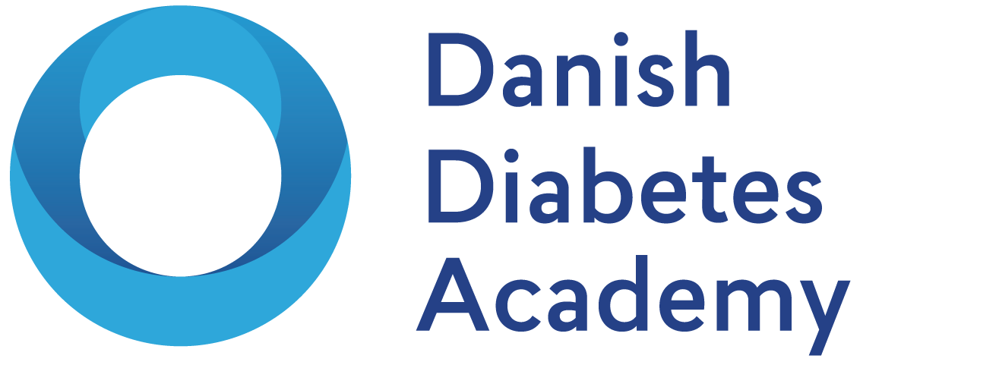
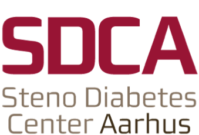

--- 
title: "Reproducible Research in R"
subtitle: "An intermediate workshop on modern approaches and workflows to processing data"
date: "Updated: `r format(Sys.time(), '%B %d %Y')`"
site: bookdown::bookdown_site
documentclass: book
bibliography: [includes/packages.bib, includes/refs.bib]
link-citations: yes
csl: includes/vancouver.csl
description: "A 3-day workshop for researchers expanding on the modern data processing toolkit for reproducible research in R."
apple-touch-icon: "images/apple-touch-icon.png"
apple-touch-icon-size: 180
favicon: "images/favicon.ico"
url: 'https\://r-cubed-intermediate.rostools.org'
---

# Welcome!

```{r, include=FALSE, eval=TRUE}
# automatically create a bib database for R packages
knitr::write_bib(
    c(.packages(), "bookdown", "knitr", "rmarkdown"),
    here::here('includes/packages.bib')
)
```

[](https://gitlab.com/rostools/r-cubed-intermediate)
[](https://creativecommons.org/licenses/by/4.0/)
[](https://opensource.org/licenses/MIT)

Reproducibility and open scientific practices are increasingly demanded of,
and needed by, scientists and researchers in our modern research environments.
As we our tools for generating data become more sophisticated and powerful,
we also need to start using more sophisticated and powerful tools for processing it.
Training on how to use these tools and build modern data analysis skills is
lacking for researchers, even though this work is highly time-consuming
and technical. As a consequence of this unawareness of the need for these skills,
how *exactly* data is processed is poorly, if at all, described in scientific
studies. This hidden aspect of research could have major impacts on the
reproducibility of studies.
This course was created specifically to start addressing these types of problems.

The course is designed as a series of participatory live-coding lessons, where
the instructor and learner code together, and is interspersed with hands-on
exercises and group work using some real-world datasets. This website contains all of the
material for the course, from reading material to exercises to images. It is
structured as a book, with "chapters" as lessons, given in order of appearance.
We make heavy use of the website throughout the course
where code-along sessions follow the material on the website nearly exactly
(with slight modifications for time or more detailed explanations).

The course material was created using [rmarkdown] to write the lessons,
[bookdown] to create the book format, [GitLab] to host the [Git] 
repository of the material, and [GitLab CI] with [Netlify] to create the website.
The original source material for this course is found on the 
[`r-cubed-intermediate`] GitLab repository.

[rmarkdown]: https://rmarkdown.rstudio.com/
[bookdown]: https://bookdown.org/yihui/bookdown/
[GitLab]: https://gitlab.com/
[Git]: https://git-scm.com/
[GitLab CI]: https://docs.gitlab.com/ee/ci/
[Netlify]: https://www.netlify.com/
[`r-cubed-intermediate`]: https://gitlab.com/rostools/r-cubed-intermediate

Want to contribute to this course? 
Check out the [README] file as well as the [CONTRIBUTING] file
on the GitLab repository for more details.
The main way to contribute is by using
[GitLab] and creating a 
[new Issue](https://gitlab.com/rostools/r-cubed-intermediate/-/issues/new)
to make comments and give feedback for the material.

[README]: https://gitlab.com/rostools/r-cubed-intermediate/-/blob/main/README.md
[CONTRIBUTING]: https://gitlab.com/rostools/r-cubed-intermediate/-/blob/main/CONTRIBUTING.md

## Re-use and licensing {#licensing}

<a rel="license" href="http://creativecommons.org/licenses/by/4.0/"></a>

The course material is licensed under the
[Creative Commons Attribution 4.0 International License](https://creativecommons.org/licenses/by/4.0/)
and the course code is licensed under a [MIT License](https://gitlab.com/rostools/r-cubed-intermediate/-/blob/main/LICENSE-MIT.md),
so the material can be used, re-used, and modified, 
as long as there is attribution to this source.

## Contributors {#contributors}

[Version 1](https://doi.org/10.5281/zenodo.4061900) contributors were:

- Luke Johnston: Brainstormed most of the course material and structure; set up
the website; organized and coordinated the course; wrote and developed the
code-along sessions; and, taught the final data analysis code-along session as
well as the lectures.
- Signe Freja Storgaard: Taught and edited the data import code-along session material.
- Andreas Halgreen Eiset: Taught and edited the "Don't Repeat Yourself" code-along
session material.
- Omar Silverman: Taught and edited the processing and cleaning code-along session material.

## Acknowledgements

Some of the material was taken and modified from multiple sources, including:

- [UofTCoders Reproducible Quantitative Methods for EEB](https://uoftcoders.github.io/rcourse/) 
- [Software and Data Carpentry](https://carpentries.org/) workshop material
- [UofTCoders material](https://uoftcoders.github.io/studyGroup/lessons/)
and [AU CRU material](https://au-cru.github.io/site/material/)
- From version 1 of the [*"Reproducible Quantitative Methods: Data analysis workflow using R"*](https://v1--dda-rcourse.netlify.com/) course

The course material also draws inspiration from these excellent resources:

- [R for Data Science](https://r4ds.had.co.nz/)
- [Advanced R](https://adv-r.hadley.nz/)
- [R Packages](https://r-pkgs.org/)

The [Danish Diabetes Academy](https://www.danishdiabetesacademy.dk/) hosted,
organized, and sponsored this course. A huge thanks to them
for their involvement, support, and sponsorship! 
[Steno Diabetes Center Aarhus](https://www.stenoaarhus.dk/) employs Luke, who is
the lead instructor and curriculum developer.

{width=90px}
{width=55px}
